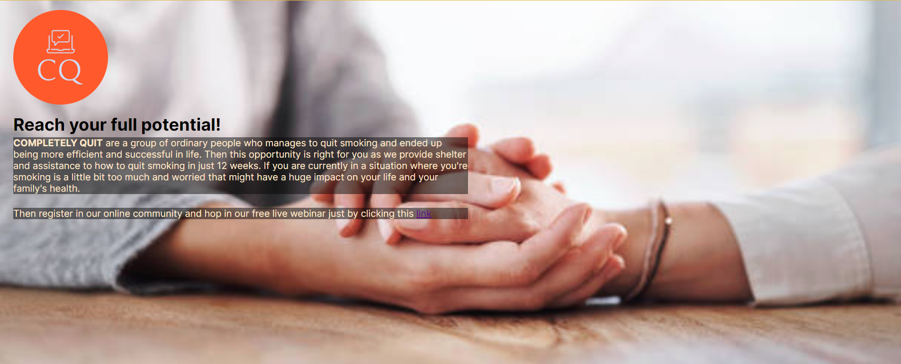

# Completely Quit

The Completely Quit website is the ultimate destination for Smoker's journey in quitting smoking and reclaiming health and vitality. Its purpose is to offer a wide range of resources and a caring community to those who are determined to overcome their addiction to tobacco.

This online community offers a secure setting for asking for help, celebrating victories, and finding support.

# Features

### Navigation

* Top left side is the logo with no smoking sign, this will bring the user to home page when clicked.
* Top center is the Need Help? section which brings to JoinUs page when clicked.
* Top right side is the navigation menu links. These composed of: Home, About and JoinUs that will link to different pages in the website.
* Home is to get back to the main landing page quickly.
* About is to find out more about Completely Quit website purpose, and its core principles. Learn why it brings us great joy to assist people in giving up smoking and regaining health and vitality.
* JoinUs ideally upon sign up gain access to additional resources, and support tools to enhance your quit experience.

### Header

* The Header is the welcome page which starts a narative about the benifits of quitting smoking. The background image color helps the narative to stand out.
* This shows consequence of reducing life expectancy due to smoking.

### Effects and Tips Narrative

* This section shows what to expect after quitting smoking. Provides a link to a blog Better Health Channel the gives further details of the advantages.
* This also gives Tips on quitting. Details are further provided in NHS Website link provided.

### About

* This shows Completely Quit website purpose, and its core principles. Learn why it brings us great joy to assist people in giving up smoking and regaining health and vitality.
* This challenges the user to reach its full potential.
* CQ Logo is placed which signifies Completely Quite.

### Join Us section

* Contains a narrative that informs the users our priority.
* Shows a form that upon sign up will ideally gain access to additional resources, and support tools to enhance your quit experience.
* The form collects Firstname, Lastname and email address that will be used as resources to provide updates to their progress.
* Information will be used to enlist the user to the online community.

### Footer

* COntains a phrase Choose Life which reminds the user how valuable there lives are.
* This section shows all the social media links the user can access to keep up to date with the Completely Quite updates.
* There are four individual links, which is Facebook, Instagram, Twitter and YouTube. Each link will take the users to a different social media of Completely Quit.

## Testing 

* This page works in different broswers such as; Google Chrome, Safari and Firefox.
* The page is responsive, all links work and it all looks good on different standard screen sizes using devtools and testing out on different devices.
* I confirm that the navigation, header, sign up and form text are all readable and easy to access and understand.
* I have confirmed that the form works. It requires entries in every field: First Name, Last Name and Email. Will only accept an email in the Email field and the radio and submit buttons work.

### Bugs

* There were no bugs when deploying my page to the GitHub Pages.

### Validator Testing

* HTML
    * No errors were found when passing through the official W3C validator.
  
* CSS 
    * No errors were found when passing through the official (Jigsaw) validator.

* Accessibility
    * I confirmed that my webiste is accessible by running it through lighthouse in devtools.

### Unfixed Bugs

* No unfixed bugs.

# Deployment

* The site was deployed to GitHub pages. The steps to deploy are as follows:
    * In GitHub pages , navigate to the Settings tab.
    * Down the left hand side menu, navigate to the Pages tab.
    * Select the Main branch and select save.
    * The page will automatically refresh and the page link will appear at the top of the GitHub pages.
    * When a green tick appears it indicates a successful deployment.

  * The live link can be found here - [Completely Quit](https://gnaces.github.io/Project-1/index.html)

